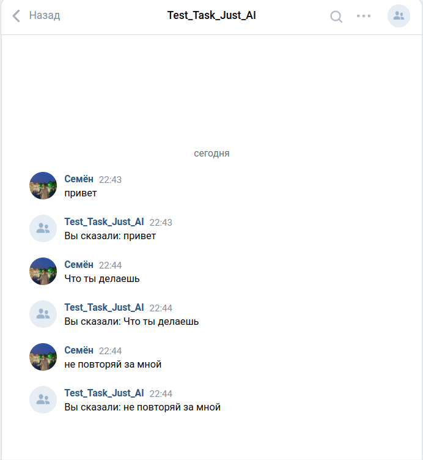

~~# BotResponder

BotResponder - это приложение на Java с использованием Spring Boot для обработки событий от BotAPI VK.

## Требования

- Java 8 или выше

## Конфигурация

Все параметры необходимые для корректного запуска и проверки задаются в конфигурационных файлах. Приложение использует `application.properties` файл для настройки и `.env` для хранения секретных данных.

Файл `.env` должен содержать следующие строки:

- secret=<ваш_secret>
- access-token=<ваш_access_token>
- v=<ваша_версия_API>
- confirmation=<ваш_confirmation>

### Описание параметров конфигурации
- secret: Секретный ключ вашего VK API.
- access-token: Токен доступа к VK API.
- v: Версия VK API, используемая вашим приложением.
- confirmation: Строка подтверждения, используемая для подтверждения сервера VK API.

### Как запустить приложение
1. Клонируйте репозиторий 
   "git clone git@github.com:navope/BotResponder.git"
2. создайте файл `.env` в корневом каталоге и заполните необходимые поля.
3. C помощью ngrok необходимо открыть доступ к внутренним ресурсам машины, на которой он запущен, из внешней сети:
   ngrok http http://localhost:8080
4. Подтвердите сервер 
5. Соберите jar 
   Для Linux: ./mvnw clean package
   Для Windows: mvnw.cmd clean package
6. Запустите приложение
   java -jar targer/BotResponder.jar

### Требования к реализации
В качестве решения хотелось бы получить ссылку на git репозиторий в котором находятся исходники Spring Boot приложения выполняющего логику бота. Все параметры необходимые для корректного запуска и проверки должны задаваться в конфигурационных файлах (необходимо решить какие именно параметры). Все сущности с помощью которых осуществляется взаимодействие должны быть представлены в виде POJO. В readme должен быть описан процесс запуска приложения и необходимые параметры конфигурации. Качество кода и выбранная внутренняя структура компонентов/сервисов также оценивается.

Важно! Нельзя использовать готовые библиотеки-реализации api для Java.

При реализации может потребоваться использование внешних https адресов для локальной машины. Для этого можно использовать ngrok.

### Пример работы бота

